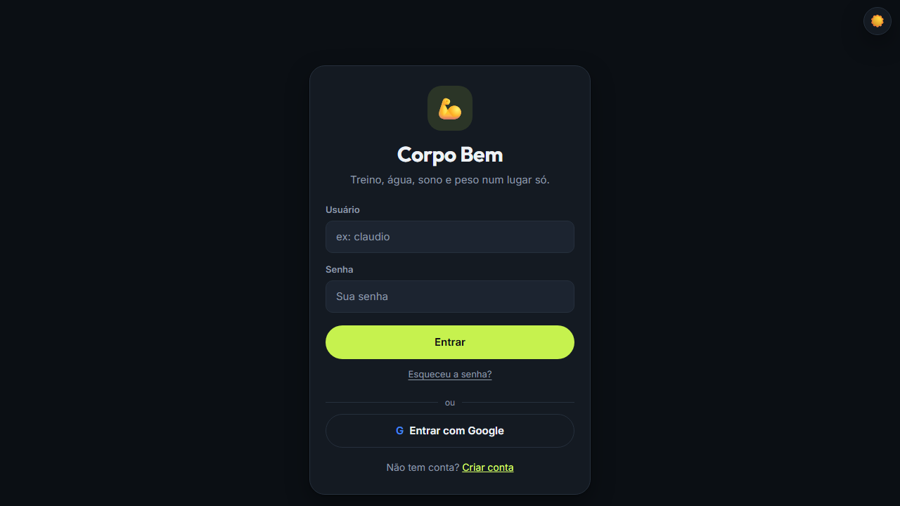

# Corpo Bem



App de treino e hábitos pensado pro celular. Você registra água, sono, treino e peso, acompanha a sequência de dias e troca o XP das metas cumpridas por recompensas que você mesmo cria. Dá pra instalar como PWA e abrir sem internet depois da primeira visita.

Site: https://corpo-bem.vercel.app

## O que tem

- Cadastro com usuário e senha ou conta Google, e um onboarding que já sugere metas conforme o objetivo (perder peso, ganhar massa ou manter).
- Metas diárias que zeram sozinhas todo dia e metas com prazo.
- Atalho de água na tela inicial (+250 ml e +500 ml).
- Planos de treino prontos (ABC, Push/Pull/Legs e corpo inteiro). O app mostra o treino da vez e passa pro próximo quando você marca que treinou.
- Calendário das últimas 12 semanas no estilo das contribuições do GitHub.
- Gráfico de peso e IMC, com exportação do histórico em CSV (abre direto no Excel).
- Backup completo da conta em JSON.
- Lojinha de recompensas com custo em XP.
- Resumo da semana que vira imagem, com botão de compartilhar pelo celular.
- Link de perfil só leitura pra mostrar o progresso a um personal ou amigo. Peso e foto não entram nesse link.
- Lembretes por push de água e de metas. Pra quem costuma treinar de manhã e ainda não registrou nada, o lembrete da meta chega ao meio-dia em vez das 20h.
- Tema claro, escuro, igual ao sistema ou automático (escuro das 19h às 6h).

## Tecnologias

JavaScript puro em módulos ES, sem framework. Firebase Authentication e Firestore guardam as contas e os dados. Chart.js desenha o gráfico, canvas-confetti faz a comemoração e html2canvas gera a imagem do resumo.

No deploy, o esbuild junta os módulos num arquivo só e o javascript-obfuscator embaralha esse arquivo. CSS e HTML saem minificados. Quem abre o F12 no site publicado não vê o código legível, que fica só neste repositório.

Os lembretes rodam numa function da Vercel (`api/send-reminders.js`) com web-push e firebase-admin.

## Estrutura

```
web-treino-metas/
├── index.html
├── manifest.json
├── sw.js                  service worker (cache offline e push)
├── build.js               build de produção (gera dist/)
├── vercel.json
├── firestore.rules        regras de segurança do banco
├── api/
│   └── send-reminders.js  function de lembretes
├── css/style.css
├── js/
│   ├── main.js            ponto de entrada
│   ├── firebase-config.js
│   ├── state.js
│   ├── ui.js              telas, modais, avisos e tema
│   ├── auth.js            login, cadastro e onboarding
│   ├── goals.js           metas e progresso
│   ├── plano.js           planos de treino
│   ├── profile.js         perfil, peso, calendário, exportações e perfil público
│   ├── rewards.js         lojinha
│   ├── notifications.js   lembretes e instalação do app
│   ├── recap.js           resumo da semana
│   └── calculos.js        contas sem DOM nem Firebase
├── scripts/servidor-dev.js servidor local
└── docs/capa.png          imagem deste README
```

## Rodando na sua máquina

```bash
npm install
npm run dev
```

O site abre em http://localhost:5311 usando o código-fonte e o Firebase de verdade.

Pra conferir o build de produção, igual ao publicado:

```bash
npm run build
npm run preview
```

O GitHub Actions (`.github/workflows/ci.yml`) roda o build a cada push, pra pegar erro de empacotamento antes da Vercel.

## Deploy na Vercel

O `vercel.json` já define o build (`npm run build`), a pasta publicada (`dist`) e os cabeçalhos de segurança. Na Vercel, cadastre estas variáveis de ambiente:

- `VAPID_PUBLIC_KEY` e `VAPID_PRIVATE_KEY`: par de chaves do Web Push, gerado com `npx web-push generate-vapid-keys`. A chave pública também fica em `js/notifications.js`.
- `FIREBASE_SERVICE_ACCOUNT`: JSON da conta de serviço em uma linha só (Firebase Console, Configurações do projeto, Contas de serviço, Gerar nova chave privada).
- `CRON_SECRET`: uma senha longa qualquer. A function recusa chamadas sem ela.

O cron gratuito da Vercel só roda uma vez por dia (23h UTC, que dá 20h em Brasília). Pra ter os lembretes de hora em hora, o workflow `.github/workflows/lembretes.yml` chama a function a cada hora. Ele precisa de dois segredos no repositório do GitHub: `SITE_URL` (endereço do site na Vercel) e `CRON_SECRET` (o mesmo valor da Vercel).

Depois do primeiro deploy, adicione o domínio da Vercel em Firebase Console, Authentication, Settings, Domínios autorizados. Sem isso o login com Google falha.

## Regras do Firestore

As regras ficam em `firestore.rules`. Cada conta só lê e grava o que está em `users/{uid}`. O resumo público (`publico/{uid}`) pode ser lido por quem tem o link, mas só o dono grava, e só com os campos do resumo.

Pra publicar:

```bash
npx firebase-tools login
npx firebase-tools deploy --only firestore:rules
```

O projeto padrão (`web-treino`) já está em `.firebaserc`.

## Trocando as chaves

Vale trocar as chaves VAPID e a conta de serviço de tempos em tempos:

1. Gere um par novo com `npx web-push generate-vapid-keys`.
2. Atualize `VAPID_PUBLIC_KEY` e `VAPID_PRIVATE_KEY` na Vercel e a chave pública em `js/notifications.js`, e faça um deploy.
3. Quem já tinha lembrete ligado precisa desligar e ligar de novo no perfil, porque a inscrição antiga foi feita com a chave velha. As inscrições que o navegador recusar (erro 404 ou 410) são apagadas sozinhas pela function.
4. Pra conta de serviço, gere uma chave nova no Firebase Console, troque `FIREBASE_SERVICE_ACCOUNT` na Vercel e apague a chave antiga no Google Cloud Console (IAM, Contas de serviço).

## Testando os lembretes sem incomodar ninguém

Pra testar push sem mandar notificação pra usuário de verdade, crie um segundo projeto no Firebase só pra testes e aponte um deploy de preview da Vercel pra ele: variáveis `FIREBASE_SERVICE_ACCOUNT` e `CRON_SECRET` próprias no ambiente Preview e, no preview, o `firebaseConfig` de `js/firebase-config.js` trocado pelo do projeto de teste. A resposta da function traz quantos pushes foram enviados, quantos falharam e quantas inscrições mortas foram removidas.

## Licença

Código sob a licença MIT (veja o arquivo LICENSE). As bibliotecas de terceiros estão em CREDITS.md.
